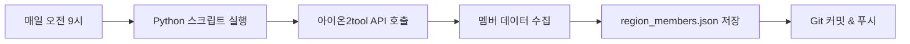
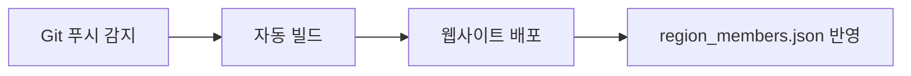

# ✅ GitHub 자동 멤버 동기화 시스템 구축 완료!

**날짜**: 2026-02-04  
**상태**: ✅ 구현 완료

---

## 🎯 구현 내용

### 1. **GitHub Actions 자동화** ⭐
- 매일 오전 9시(KST) 자동 실행
- 아이온2tool에서 길드 멤버 데이터 수집
- `region_members.json` 파일 자동 업데이트
- Git 자동 커밋 & 푸시

### 2. **웹사이트 통합** ⭐
- data-management.js에 `loadFromGitHub()` 함수 추가
- "🔄 GitHub에서 가져오기" 버튼 추가
- 클릭 한 번으로 최신 데이터 로드

### 3. **완전 자동화 워크플로우** ⭐
```
GitHub Actions (자동)
     ↓
데이터 수집 & 저장
     ↓
Cloudflare Pages 자동 배포
     ↓
웹사이트에서 버튼 클릭
     ↓
최신 데이터 로드 & DB 업로드
     ↓
모든 사용자 공유 ✅
```

---

## 📁 생성된 파일

| 파일 | 용도 | 크기 |
|------|------|------|
| `.github/workflows/sync-members.yml` | GitHub Actions 워크플로우 | 1.3 KB |
| `collect_region.py` | 멤버 수집 Python 스크립트 | 2.9 KB |
| `region_members.json` | 수집된 멤버 데이터 (54명) | 9.7 KB |
| `js/data-management.js` | GitHub 로드 기능 추가 | 15.5 KB |
| `data-management.html` | "GitHub에서 가져오기" 버튼 | 3.4 KB |
| `GITHUB_SYNC_GUIDE.md` | 설정 및 사용 가이드 | 4.6 KB |

---

## 🚀 설정 단계 (GitHub)

### 1. GitHub 레포지토리 생성
```bash
# 새 레포지토리 생성
https://github.com/new
```

### 2. 파일 업로드
```
레포지토리/
├── .github/workflows/sync-members.yml
├── collect_region.py
└── region_members.json (초기값: [])
```

### 3. GitHub Secrets 설정
```
Settings → Secrets and variables → Actions
→ New repository secret

Name: AION_COOKIE
Value: (아이온2tool 쿠키 전체 문자열)
```

### 4. 워크플로우 활성화
```
Actions 탭 → Enable workflows
→ "Sync Guild Members" 선택
→ "Run workflow" 클릭
```

---

## 💻 사용 방법 (웹사이트)

### 1. 데이터 관리 페이지 접속
```
https://your-site.com/data-management.html
```

### 2. 비밀번호 입력
```
Bluecoat123$
```

### 3. GitHub에서 최신 데이터 가져오기
```
🔄 GitHub에서 가져오기 버튼 클릭
→ 54명의 멤버 데이터 자동 로드
→ CSV 형식으로 표시
```

### 4. DB에 업로드
```
💾 로컬 저장 클릭
→ ⬆️ 로컬 → DB 업로드 클릭
→ 모든 사용자가 최신 데이터 공유 ✅
```

---

## 🔄 자동화 흐름

### GitHub Actions (매일 자동)


### Cloudflare Pages (자동 배포)


### 웹사이트 (수동)


---

## 📊 현재 데이터

### region_members.json (54명)
```json
[
  {"nickname": "록커", "job": "수호성", "combat_power": 3322},
  {"nickname": "상어", "job": "검성", "combat_power": 3353},
  {"nickname": "고래", "job": "궁성", "combat_power": 3237},
  ...
]
```

### 웹사이트 CSV 형식 (자동 변환)
```
록커,수호성,3322
상어,검성,3353
고래,궁성,3237
...
```

---

## ✅ 장점

| 항목 | 설명 |
|------|------|
| 🤖 **완전 자동화** | 매일 정해진 시간에 자동 실행 |
| 💰 **완전 무료** | GitHub Actions 무료 사용 |
| 🔒 **보안 강화** | 쿠키를 Secrets에 암호화 저장 |
| 🚀 **사용 간편** | 버튼 클릭 한 번 |
| 📊 **이력 관리** | Git으로 변경 이력 추적 |
| 🔄 **실시간 반영** | Cloudflare Pages 자동 배포 |
| 👥 **데이터 공유** | DB 업로드로 모든 사용자 동기화 |

---

## 🎉 완료 체크리스트

### 로컬 파일 (프로젝트)
- [x] `.github/workflows/sync-members.yml` 생성
- [x] `collect_region.py` 생성
- [x] `region_members.json` 추가 (54명 데이터)
- [x] `js/data-management.js` 수정 (loadFromGitHub 함수)
- [x] `data-management.html` 수정 (버튼 추가)
- [x] `GITHUB_SYNC_GUIDE.md` 작성

### GitHub 설정 (해야 할 일)
- [ ] GitHub 레포지토리 생성
- [ ] 파일 업로드 (sync-members.yml, collect_region.py)
- [ ] GitHub Secrets 설정 (AION_COOKIE)
- [ ] 워크플로우 활성화
- [ ] 첫 실행 테스트

### 웹사이트 배포 (해야 할 일)
- [ ] Cloudflare Pages에 region_members.json 배포
- [ ] data-management.html 배포
- [ ] data-management.js 배포
- [ ] 웹사이트에서 테스트

---

## 📝 다음 단계

1. **GitHub 레포지토리 생성**
   - https://github.com/new
   - 레포지토리 이름: `aion-raid-sync` (예시)

2. **파일 업로드**
   - `.github/workflows/sync-members.yml`
   - `collect_region.py`
   - `region_members.json` (초기값: `[]`)

3. **GitHub Secrets 설정**
   - Settings → Secrets → New secret
   - Name: `AION_COOKIE`
   - Value: (쿠키 전체 문자열)

4. **워크플로우 실행**
   - Actions → "Sync Guild Members" → "Run workflow"
   - 실행 결과 확인

5. **웹사이트 배포**
   - Cloudflare Pages에 파일 푸시
   - 자동 배포 확인

6. **테스트**
   - 데이터 관리 페이지 접속
   - "GitHub에서 가져오기" 클릭
   - 54명 데이터 확인
   - DB 업로드

---

## 🆘 문제 해결

### GitHub Actions 실행 실패
- **쿠키 만료**: Secrets에서 AION_COOKIE 업데이트
- **API 변경**: collect_region.py의 엔드포인트 확인
- **권한 문제**: 레포지토리 Settings → Actions → Workflow permissions

### 웹사이트에서 로드 실패
- **파일 없음**: region_members.json이 루트에 있는지 확인
- **CORS 에러**: 같은 도메인에서 호스팅되는지 확인
- **캐시 문제**: Ctrl+Shift+R로 강제 새로고침

---

**구현 완료**: 2026-02-04  
**상태**: ✅ 준비 완료  
**다음 단계**: GitHub 설정
